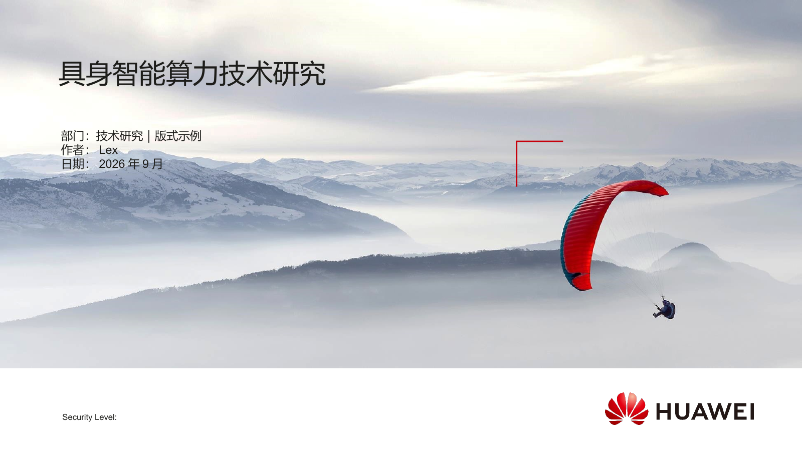
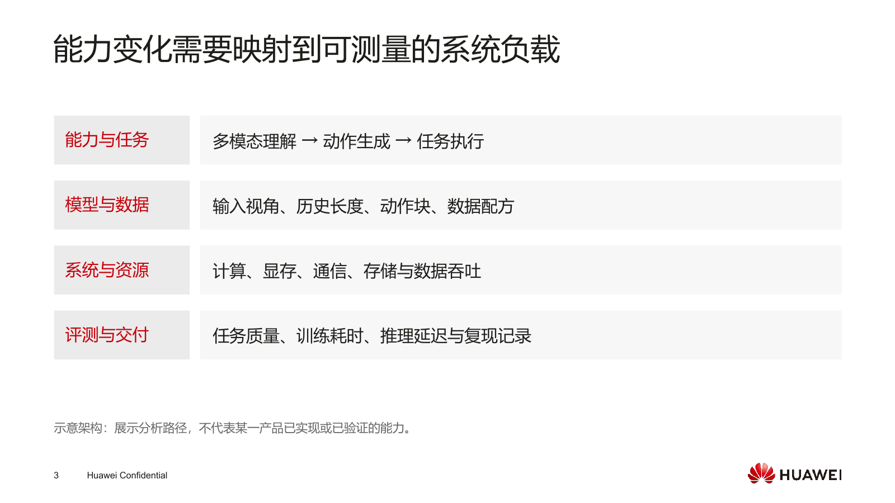
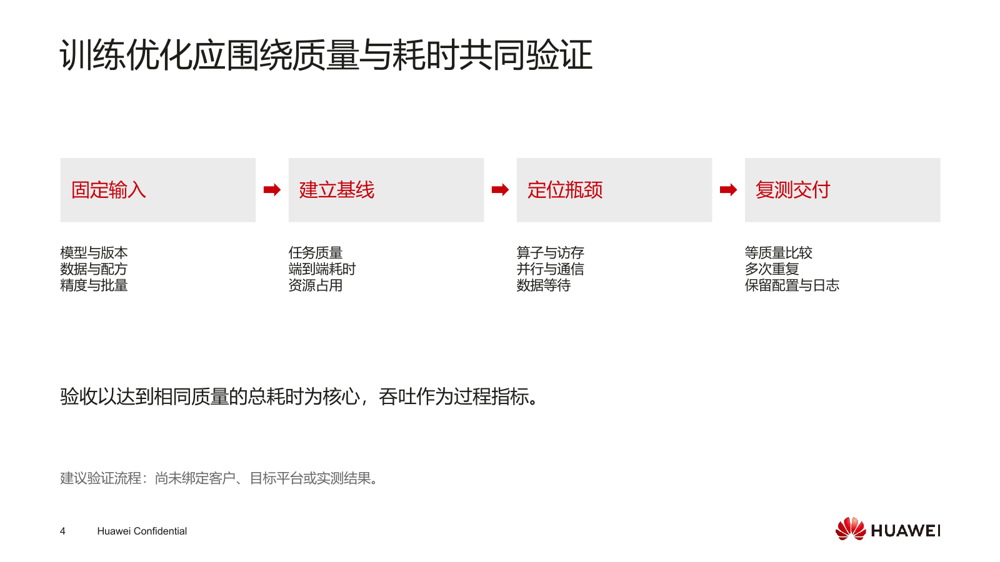
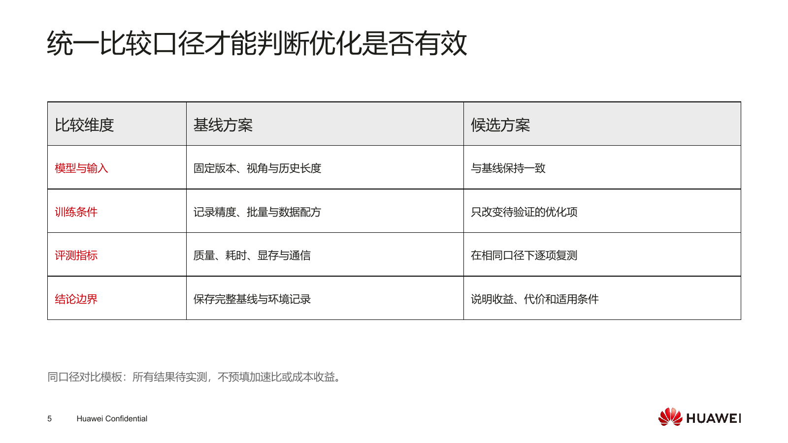
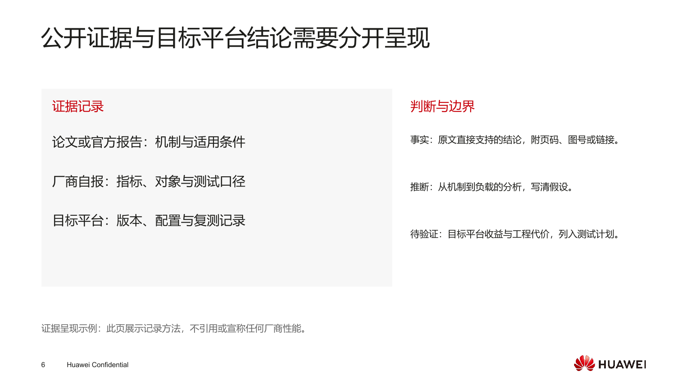
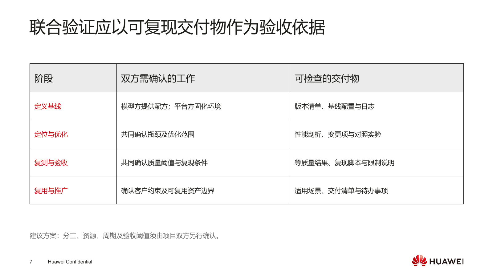
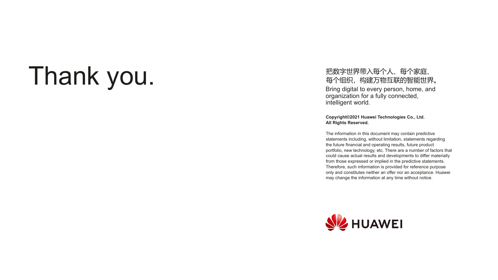
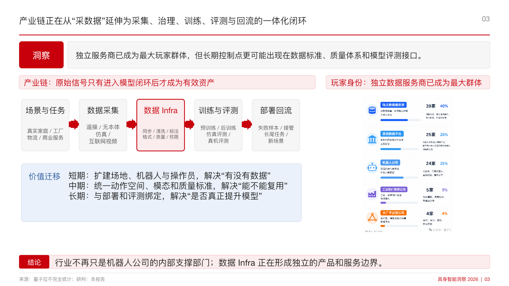
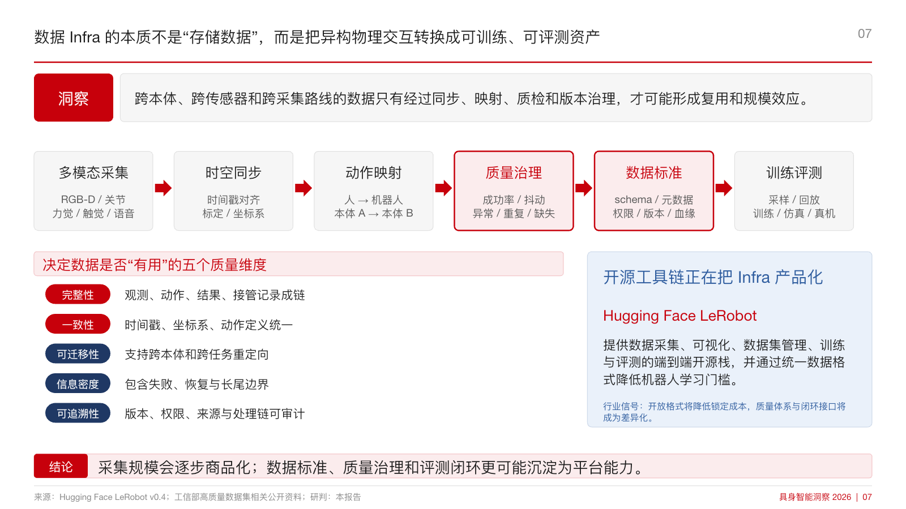
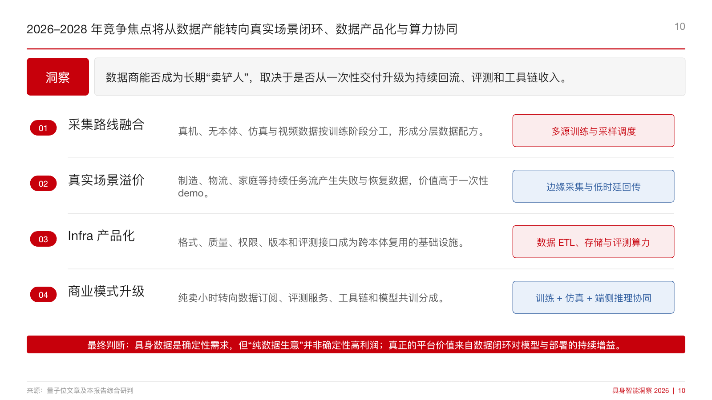

# Lex AI Research Skills

**Research is a system, not a document.**

[English](README.md) | [简体中文](README.zh-CN.md)

A library of reusable Codex skills for industrial research, technology analysis, evidence organization, and executive communication. It packages a personal research method into installable workflows that can be used independently or combined from question framing through editable presentation delivery.

## Available Skills

| Skill | Purpose | Best for | Main output |
| --- | --- | --- | --- |
| `tech-research-deck` | Frames and structures technology research. | Architectures, routes, cases, and trends. | A source-aware, slide-ready research narrative. |
| `huawei-insight-deck` | Turns established judgments into consistent pages. | Executive decks, one-pagers, and page production. | An editable 16:9 PowerPoint deck with render QA. |

`tech-research-deck` is responsible for the research question, evidence, architecture, routes, cases, and trends. `huawei-insight-deck` is responsible for turning an established argument into consistent, editable pages designed for executive reading. Each skill can be used on its own, or they can be chained when a task needs both research development and presentation production.

## Why This Repository Exists

Reusable research quality does not come from a single prompt. It comes from a repeatable method for framing the question, collecting and qualifying evidence, comparing alternatives on consistent dimensions, writing a clear claim for each page, and checking the rendered result before delivery.

This repository makes that method explicit. The skills preserve the decisions that are easy to lose between projects: where the research boundary sits, what counts as sufficient evidence, which comparison fields remain stable, how facts are separated from analyst judgment, and how a page is validated after construction. The result is a working library for producing research that is easier to inspect, update, and communicate.

## How It Works

```text
source material
  -> research framing
  -> evidence and source verification
  -> architecture and route decomposition
  -> page-level claims
  -> slide construction
  -> render and visual QA
  -> editable PPT output
```

- **Claim-first:** each page starts with the conclusion it must establish. Evidence, diagrams, and comparisons are selected to support that claim rather than accumulated without hierarchy.
- **Traceability:** important facts, numbers, benchmark results, and company statements retain their source, date, object, and measurement context. Confirmed facts remain distinct from analyst judgment.
- **Like-for-like comparison:** competing routes, products, cases, or scenarios are compared using the same dimensions so that differences are meaningful rather than rhetorical.
- **Editable delivery:** final pages use native PowerPoint text, shapes, tables, and charts wherever practical. The deck remains usable after delivery instead of becoming a set of flattened images.

## Quick Start

Use the research skill when the question is still being defined or the evidence and technical structure need to be developed:

```text
$tech-research-deck
```

Use the presentation skill when the argument already exists and needs to become a consistent deck or one-pager designed for executive reading:

```text
$huawei-insight-deck
```

For an end-to-end assignment, start with `$tech-research-deck` to establish the research structure and page claims, then use `$huawei-insight-deck` to construct, render, inspect, and deliver the editable presentation.

## Installation

### Prerequisites

- Codex with local skill discovery enabled.
- Git for cloning and updating the library.
- Python 3 standard library for official-template fetch, assembly and checks. The optional sample builder uses Node.js and Codex’s bundled `@oai/artifact-tool`, with reference fonts available locally.
- Another native PPTX editor can supply body content when that runtime is unavailable. Only historical scripts require `python-pptx`.
- LibreOffice and Poppler are optional but useful for local slide rendering and visual QA. Codex may also provide equivalent presentation tooling in its runtime.

### Common setup

```bash
git clone https://github.com/hoilex0421-star/lex-ai-research-skills.git
cd lex-ai-research-skills
mkdir -p ~/.codex/skills
```

If `~/.codex/skills/huawei-insight-deck` or `~/.codex/skills/tech-research-deck` already exists, back up or remove the old installation before continuing. Run this non-destructive preflight check before choosing either option; it also detects broken symlinks and exits without changing them:

```bash
for skill in huawei-insight-deck tech-research-deck; do
  target="$HOME/.codex/skills/$skill"
  if [ -e "$target" ] || [ -L "$target" ]; then
    printf 'Installation conflict: %s already exists. Back it up or remove it first.\n' "$target" >&2
    exit 1
  fi
done
```

After completing the common setup, choose one of the following installation options.

### Option A: Symlinks

Symlinks keep the installed skills connected to the cloned repository, so repository updates are immediately available in Codex.

```bash
ln -s "$PWD/skills/huawei-insight-deck" ~/.codex/skills/huawei-insight-deck
ln -s "$PWD/skills/tech-research-deck" ~/.codex/skills/tech-research-deck
```

### Option B: Direct copies

Use direct copies when the installed skills should remain independent of the cloned repository.

```bash
cp -R skills/huawei-insight-deck ~/.codex/skills/huawei-insight-deck
cp -R skills/tech-research-deck ~/.codex/skills/tech-research-deck
```

Restart Codex or open a new task after installation so the skills are discovered.

## Usage Examples

### Technology research

```text
$tech-research-deck
Build an executive research deck on embodied AI data infrastructure. Define the industry boundary, map the value chain from collection and teleoperation to processing, simulation, evaluation, and delivery, compare real-world and synthetic-data routes on consistent dimensions, identify representative companies and projects with traceable sources, and conclude with evidence-based implications for model training and AI infrastructure through 2028.
```

### Executive presentation production

```text
$huawei-insight-deck
Turn the approved embodied AI data infrastructure research outline into an editable 16:9 executive reading deck. Use one claim per page, the pinned official Huawei 2021 light template for cover, contents/section navigation, body and ending, native PowerPoint elements, concise source notes, and consistent comparison layouts. Render the full deck, inspect every page for clipping, overlap, hierarchy, and source readability, then deliver the editable PPTX.
```

## Official Template and Visual Gallery

The default is the [official Huawei light 16:9 template, 2021](https://e.huawei.com/cn/documents/others/4f951fb72e1944288d3aa73bf40d8a8b). Cover, contents, body and ending reuse its actual shell. It has no separate chapter master: the contents layout serves as section navigation, with an optional red current item added by this library.

[Editable eight-slide sample](assets/official-style/official-template-example.pptx) · [PDF preview](assets/official-style/official-template-example.pdf) · [Reproduction guide](skills/huawei-insight-deck/references/production.md) · [Validation record](assets/official-style/validation.md)

### 42 layouts, one representative slide each

The complete **H01–H42** atlas follows SeanDongX's page-type catalog while keeping
the same official template. It adds varied photo, timeline, chart, map, commercial,
planning and human–agent collaboration examples.

[Browse all 42 slides](assets/layout-atlas/README.md) · [Editable PPTX](assets/layout-atlas/huawei-layout-atlas-42.pptx) · [PDF](assets/layout-atlas/huawei-layout-atlas-42.pdf) · [Layout catalog](skills/huawei-insight-deck/references/layout-atlas.md)

| H13 Captioned image strip | H16 Combo chart |
| --- | --- |
|  |  |
| H21 Map locations | H39 Organization protocol |
|  |  |

The catalog preserves numbering, including the closing layout at H10. It contains
eight native charts with embedded data workbooks, six native tables, and editable
text/mechanism diagrams. Data, pricing, people, interviews and cases are illustrative;
photos are AI-generated scene examples, not business evidence.

### Basic eight-slide sample

| Official cover | Contents as section navigation |
| --- | --- |
|  |  |
| Architecture | Validation flow |
|  |  |
| Like-for-like comparison | Evidence and inference |
|  |  |
| Joint validation plan | Official ending |
|  |  |

Content is illustrative methodology and proposed validation, not measured performance or agreed partnerships. New text, diagrams and two tables are native editable objects; official background artwork remains an image.

[SeanDongX/guizang-ppt-skill](https://github.com/SeanDongX/guizang-ppt-skill) informs content organization only. No implementation/assets are copied, and its visual style does not override the official source. Original artwork, marks and source wording belong to Huawei. This library and sample are not official Huawei publications and imply no endorsement.

## Historical Case Gallery

### Embodied Data Industry Research: From Data Factories to Physical AI Infrastructure

This historical example uses the previous custom reading-deck style, not the current official-template specification. It is a real output produced with the research and presentation workflow in this repository. It demonstrates how a broad industrial question can be turned into an evidence-led narrative, a structured industry model, an operating workflow, and a forward outlook. The source PPTX is not provided for download.

| Research framing | Industry architecture |
| --- | --- |
|  |  |
| **Research framing:** defines the research boundary, audience, and central question. | **Industry architecture:** maps the participants, layers, and value flow across the industry. |

| Operating workflow | Forward outlook |
| --- | --- |
|  |  |
| **Operating workflow:** explains how a data factory turns collection into validated training assets. | **Forward outlook:** summarizes the expected transition toward physical AI infrastructure from 2026 to 2028. |

## Repository Structure

```text
lex-ai-research-skills/
├── README.md
├── README.zh-CN.md
├── assets/
│   ├── official-style/  # Current sample, previews and validation
│   └── cases/
│       └── embodied-data-industry/
│           ├── cover.png
│           ├── industry-chain.png
│           ├── data-factory-workflow.png
│           └── outlook-2026-2028.png
└── skills/
    ├── huawei-insight-deck/
    │   ├── SKILL.md
    │   ├── agents/
    │   ├── assets/  # Official-source manifest and example content
    │   ├── references/
    │   └── scripts/
    └── tech-research-deck/
        ├── SKILL.md
        ├── agents/
        └── references/
```

Each skill can be installed and invoked independently. Its `SKILL.md` defines when to use it and how the workflow operates; supporting references hold detailed research or layout rules; scripts provide deterministic presentation helpers where production requires them. The core instructions are stored with each skill, while optional production helpers use the prerequisites listed above.

## Quality Principles

- **Claim-first pages:** one page carries one defensible argument, stated before supporting detail.
- **Evidence traceability:** material facts and numbers preserve their source, date, scope, and measurement context; source notes remain connected to the claim they support.
- **Consistent comparison dimensions:** routes, products, companies, and cases are evaluated using identical fields wherever a direct comparison is intended.
- **Direct body copy:** body text avoids unnecessary quotation marks. Quotation marks are reserved for verbatim language, official terms, or wording that is itself under analysis.
- **Official visual rules:** preserve source masters, fonts, positions and footers. The title carries the claim; additional insight or conclusion strips are optional.
- **Editable PowerPoint:** text, shapes, tables, and charts remain editable so the output can be reviewed and revised after delivery.
- **Render QA:** every completed deck is rendered and visually inspected for overlap, clipping, alignment, hierarchy, image placement, and source-note readability.

## What Comes Next

The library will continue to add reusable skills for research, analysis, and communication as the underlying methods become stable enough to package and maintain.
