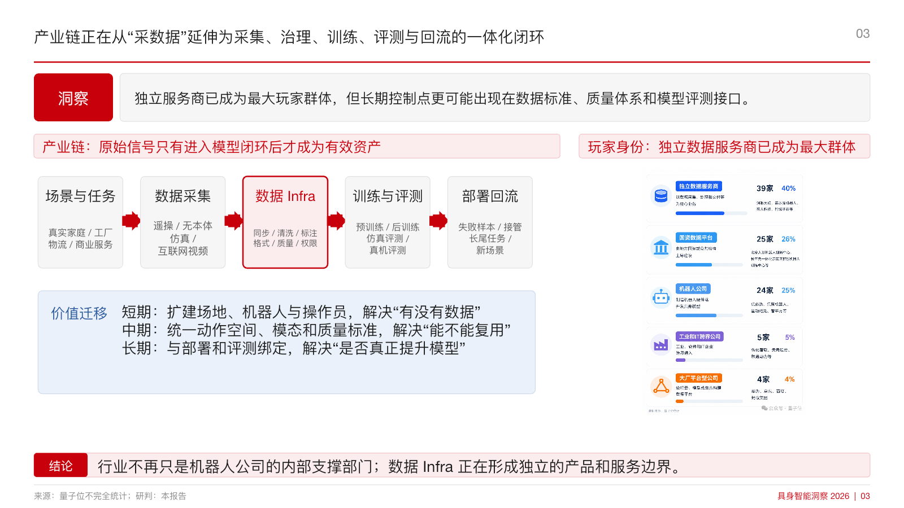
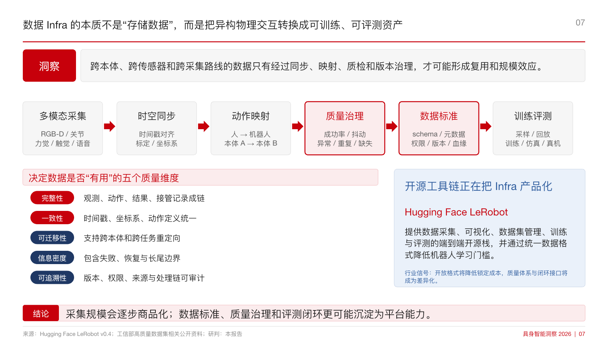
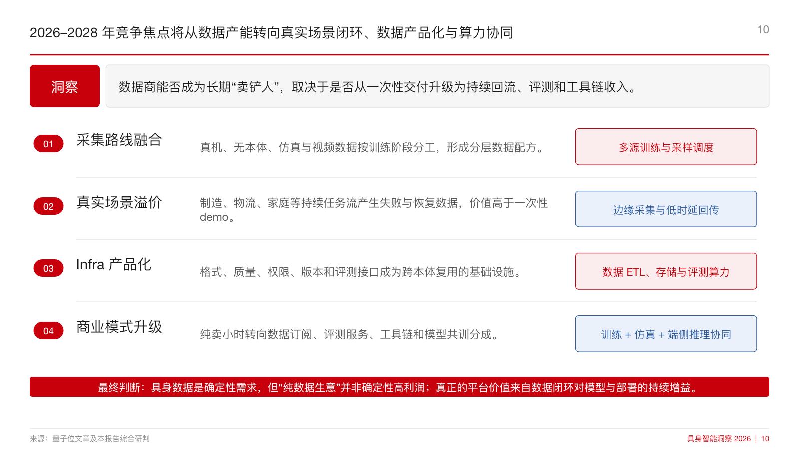

# Lex AI Research Skills

[English](README.md) | [简体中文](README.zh-CN.md)

面向产业研究（偏技术方向）和高层汇报的可复用 Codex 技能库。
持续刷新

## 可用技能

| 技能 | 作用 | 适用场景 | 主要输出 |
| --- | --- | --- | --- |
| `tech-research-deck` | 定义并组织技术研究 | 架构、路线、案例、趋势 | 有来源支撑的研究叙事 |
| `huawei-insight-deck` | 将判断转化为一致页面 | 高管报告、单页、成稿制作 | 经渲染检查的可编辑 PPT |

`tech-research-deck` 负责研究问题、证据、技术架构、路线、案例和趋势，适合从问题尚未定型、材料仍需核验的阶段开始工作。`huawei-insight-deck` 负责把已经形成的判断转成结构一致、可编辑、适合高管阅读的页面。两项技能可以单独使用，也可以串联完成从研究形成到演示交付的完整任务。

## 为什么建立这个仓库

稳定的研究质量并不来自一次 prompt，而来自一套可以重复执行的研究框架：先明确问题与边界，再收集和核验证据；用相同字段比较路线、产品与案例；为每一页写出明确论点；最后检查实际渲染结果是否准确、清晰、可读。

这个仓库把上述方法沉淀为可安装的技能，保留跨项目最容易丢失的关键约束：研究边界如何划定，证据达到什么标准，同字段比较怎样保持一致，事实与分析判断如何区分，页面完成后如何做视觉 QA。由此产出的研究更容易检查、更新、复用和沟通。

## 工作方式

```text
源材料
  -> 研究定界
  -> 证据与来源核验
  -> 架构与路线拆解
  -> 页面级论点
  -> 幻灯片构建
  -> 渲染与视觉 QA
  -> 可编辑 PPT
```

- **结论先行：** 每页先确定要证明的结论，再选择支撑它的证据、图示和比较项，避免材料堆积却缺少主次。
- **证据可追溯：** 重要事实、数字、基准结果和公司表述保留来源、日期、对象与口径，已确认事实与分析判断明确分开。
- **同字段比较：** 对技术路线、产品、案例或情景采用一致维度，确保差异来自可比信息，而不是表达方式。
- **可编辑交付：** 在可行范围内使用 PowerPoint 原生文本、形状、表格和图表，保证交付后仍可审阅和修改。

## 快速开始

当研究问题仍需定义，或证据与技术结构尚未建立时，调用研究技能：

```text
$tech-research-deck
```

当核心论点已经形成，需要制作成一致的高管报告或单页时，调用演示技能：

```text
$huawei-insight-deck
```

端到端任务可以先用 `$tech-research-deck` 建立研究结构、证据链和页面论点，再用 `$huawei-insight-deck` 完成页面构建、渲染检查与可编辑演示文稿交付。

## 安装

### 环境要求

- 支持本地技能发现的 Codex。
- 用于克隆和更新技能库的 Git。
- 运行 `huawei-insight-deck` 随附的可选 PowerPoint 辅助脚本与示例时，需要 Python 3 和 `python-pptx`。
- LibreOffice 与 Poppler 为可选工具，可用于本地幻灯片渲染和视觉 QA；也可以使用 Codex 运行环境提供的同类演示工具。

### 公共准备

```bash
git clone https://github.com/hoilex0421-star/lex-ai-research-skills.git
cd lex-ai-research-skills
mkdir -p ~/.codex/skills
```

如果 `~/.codex/skills/huawei-insight-deck` 或 `~/.codex/skills/tech-research-deck` 已经存在，请先备份或移除旧版本。选择安装方式前，运行下面的非破坏性检查；它也能识别失效的软链接，并会在发现冲突时直接退出，不会改动现有文件：

```bash
for skill in huawei-insight-deck tech-research-deck; do
  target="$HOME/.codex/skills/$skill"
  if [ -e "$target" ] || [ -L "$target" ]; then
    printf 'Installation conflict: %s already exists. Back it up or remove it first.\n' "$target" >&2
    exit 1
  fi
done
```

完成公共准备后，从以下两种方式中选择一种。

### 方式 A：软链接

软链接会让已安装技能持续指向克隆的仓库，因此仓库更新后，Codex 可以直接使用最新内容。

```bash
ln -s "$PWD/skills/huawei-insight-deck" ~/.codex/skills/huawei-insight-deck
ln -s "$PWD/skills/tech-research-deck" ~/.codex/skills/tech-research-deck
```

### 方式 B：直接复制

如果希望已安装技能与克隆仓库相互独立，可以直接复制目录。

```bash
cp -R skills/huawei-insight-deck ~/.codex/skills/huawei-insight-deck
cp -R skills/tech-research-deck ~/.codex/skills/tech-research-deck
```

安装完成后，请重启 Codex 或新开一个任务，让 Codex 重新发现这些技能。

## 使用示例

### 技术研究

```text
$tech-research-deck
制作一份面向管理层的具身智能数据基础设施研究报告。先界定产业边界，梳理从数据采集、遥操作到处理、仿真、评测和交付的价值链；再用一致字段比较真实世界数据与合成数据路线，识别有可追溯来源的代表性公司和项目，最后基于证据判断其对模型训练和 AI 基础设施在 2028 年前的影响。
```

### 高管演示制作

```text
$huawei-insight-deck
把已经确认的具身智能数据基础设施研究提纲制作成一份可编辑的 16:9 高管阅读型报告。每页只表达一个明确论点，采用克制的红色视觉体系、PowerPoint 原生元素、简洁来源注释和一致的比较版式。完成后渲染全部页面，逐页检查裁切、重叠、层级、图片位置和来源可读性，并交付可编辑 PPTX。
```

## 案例展示

### 具身数据产业研究：从数据工厂到物理 AI 基础设施

这是由本仓库研究与演示工作流产出的真实案例，展示如何把宽泛的产业问题转化为有证据支撑的研究叙事、结构化产业模型、运营流程和趋势判断。案例不提供源 PPTX 下载。

<table>
  <tr>
    <td width="50%"></td>
    <td width="50%"></td>
  </tr>
  <tr>
    <td><strong>研究定调</strong><br>界定研究边界，呈现具身数据从数据生产走向物理 AI 基础设施的核心命题。</td>
    <td><strong>产业架构</strong><br>梳理产业链结构及具身数据层在其中的位置。</td>
  </tr>
  <tr>
    <td width="50%"></td>
    <td width="50%"></td>
  </tr>
  <tr>
    <td><strong>运营流程</strong><br>把数据工厂拆解为可检查、可比较的端到端流程。</td>
    <td><strong>趋势展望</strong><br>基于证据形成 2026-2028 年分阶段产业判断。</td>
  </tr>
</table>

## 仓库结构

```text
lex-ai-research-skills/
├── README.md
├── README.zh-CN.md
├── assets/
│   └── cases/
│       └── embodied-data-industry/
│           ├── cover.png
│           ├── industry-chain.png
│           ├── data-factory-workflow.png
│           └── outlook-2026-2028.png
└── skills/
    ├── huawei-insight-deck/
    │   ├── SKILL.md
    │   ├── agents/
    │   ├── references/
    │   └── scripts/
    └── tech-research-deck/
        ├── SKILL.md
        ├── agents/
        └── references/
```

每项技能都可以独立安装和调用。`SKILL.md` 定义适用条件与工作流程，`references` 保存研究或版式的详细规则，`scripts` 在演示制作需要时提供可重复执行的辅助能力。核心说明均随技能保存，可选制作工具则使用上文列出的运行依赖。

## 质量原则

- **结论先行：** 一页承载一个可论证的结论，并在支撑材料之前明确表达。
- **证据可追溯：** 关键事实和数字保留来源、日期、范围与测量口径，来源注释始终对应其支撑的论点。
- **同字段比较：** 需要直接比较的路线、产品、公司和案例采用相同字段与评价维度。
- **正文直接表达：** 正文非必要不加引号；仅在逐字引用、官方术语或分析特定措辞时使用引号。
- **统一结论标签：** 页面顶部结论条使用 `洞察`，不用 `核心判断`。
- **PowerPoint 可编辑：** 文本、形状、表格和图表保持可编辑，便于交付后的审阅与修订。
- **渲染 QA：** 每份完成的报告都要经过渲染和逐页视觉检查，覆盖重叠、裁切、对齐、层级、图片位置与来源注释可读性。

## 后续方向

这个技能库会持续增加面向产业研究、技术分析和高管沟通的可复用技能。
